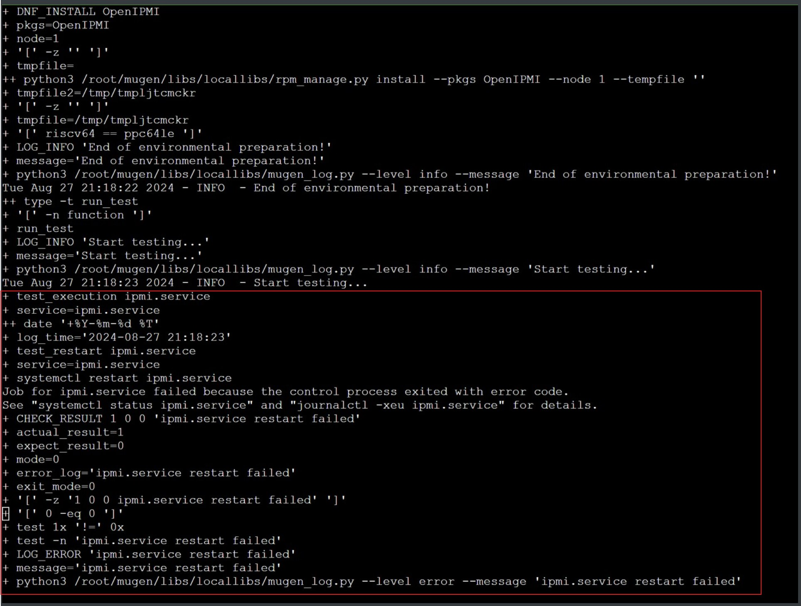
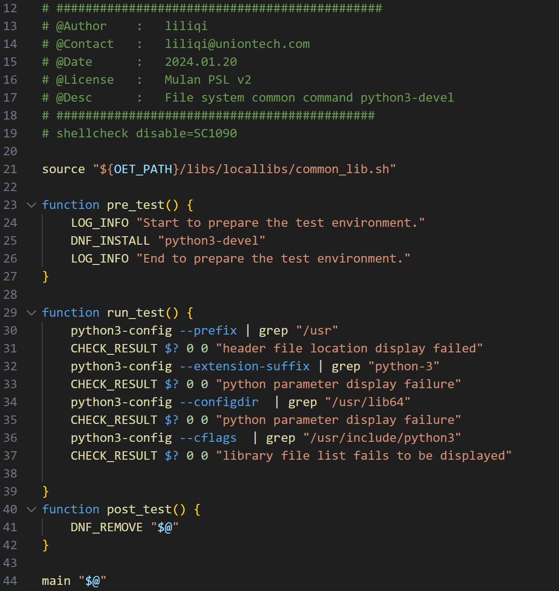

## mugen使用方法和失败测试用例分析流程和方法

### 1. mugen介绍

[mugen](https://gitee.com/openeuler/mugen) 是 openEuler 社区开源的自动化测试框架，提供公共配置和方法以便社区开发者进行测试代码的编写和执行，它由 python + shell 这两种脚本语言编写而成


mugen.sh：主程序脚本

dep_install.sh: 安装执行测试所需的依赖软件的脚本

suite2cases: 存放测试套的目录(json文件)

testcases: 存放测试用例的目录(shell脚本)

libs: 程序运行所需要的一些库，包括脚本运行需要的一些

mugen 测试套 850+，测试用例 5800+

#### 1.1 mugen测试用例范围


cli-test：命令行测试

doc-test：文件系统测试

embedded-test：嵌入式相关测试

feature-test：openEuler所支持的一些特性测试

security_test：安全测试

smoke-test：冒烟测试

system-test：系统测试

#### 1.2 mugen 测试套和测试用例

##### 1.2.1 mugen测试套

mugen 每一个测试套都是一个json文件


上图是测试curl命令的测试套，包含多个测试用例，其中的path指出了测试套中的测试用例所在路径，这是一个比较简单的测试套，执行该测试套不需要其他额外的条件，使用默认环境即可


上图是一个比较复杂的测试套，里面定义了执行该测试套所需要的环境的参数，这些参数包括：测试机数量，测试机类型，网卡数量以及磁盘数量和大小

##### 1.2.2 mugen测试用例

mugen每一个测试用例都是一个shell文件，测试用例的架构分为三个部分，分别是：

pre_test(): 用来定义测试前的环境准备, 例如测试所需工具，软件包的安装

run_test(): 用来执行测试点，每执行一个测试点，都会用自定义函数 CHECK_RESULT 来检查测试结果是否符合预期

post_test(): 用来将测试环境恢复和还原

CHECK_RESULT 这个自定义函数有4个参数，第1个参数表示测试点返回的结果，第2个参数表示预期结果，第3个参数表示对比模式(0代表返回结果和预期结果相等，1代表返回结果与预期结果不等)，第4个参数表示发现问题后输出的信息

这是 curl 测试套里的一个测试用例


#### 1.3 mugen 测试流程


mugen的测试流程是: 

主程序运行后，会先找到并调用要执行的测试套，然后根据测试套定义的环境参数来判断当前测试环境是否符合该测试套的要求，如果不符合就退出该测试套，并将测试结果标记为skip，如果符合，就调用测试套里定义的测试用例。在执行测试用例前，也会先根据测试用例里定义的环境参数来判断当前测试环境是否符合测试用例的要求，如果不符合，就会退出该测试用例，并将测试结果标记为skip，如果符合，就根据测试套中定义的测试用例所在路径找到并执行相关测试用例。

#### 1.4 mugen 使用方法

步骤1：获取源码

````
$ git clone https://gitee.com/openeuler/mugen.git
````

步骤2：安装依赖软件

````
$ cd mugen
$ bash dep_install.sh
````

步骤3：配置测试套环境变量

````
$ bash mugen.sh -c --ip $ip --password $passwd --user $user --port $port
````

ip：测试机的ip地址

user：测试机的登录用户，默认为root

password: 测试机的登录密码

port：测试机ssh登陆端口，默认为22

测试套需要几个测试机，这个命令就得执行几次，当需要多个测试机的时候，测试机之间是通过ssh方式连接的

配置完测试环境后，会在生成一个环境变量文件 ./conf/env.json，每个测试机是一个node，所有node的信息在执行上面的命令后自动添加到这个文件中


步骤4：执行测试

````
$ bash mugen.sh -a                             //执行所有用例 
$ bash mugen.sh -f testsuite                   //执行指定测试套 
$ bash mugen.sh -f testsuite -r testcase       //执行单条测试用例 
````

在命令行中加入-x，日志会输出测试用例shell脚本的执行过程，

````
$ bash mugen.sh -a -x 
$ bash mugen.sh -f testsuite –x
$ bash mugen.sh -f testsuite -r testcase -x
````

测试结果

这是执行curl这个测试套的测试结果，可以看到一共9个测试用例, 7个success, 2个fail，没有skip的，测试完成后，测试结果和日志会分别存储在当前目录下的 results 和 logs 目录下


### 2. 失败测试用例分析

#### 2.1 mugen失败测试用例分析流程


mugen失败测试用例分析流程是：

1）为了排除由于执行前序测试用例破坏了测试环境导致失败的这种情况，首先在一个新的干净的环境里，复测测试用例，执行时一定要添加参数 –x，方便后续通过日志查看完整的执行过程，找出失败的测试点

2）如果复测成功，表示测试用例通过，之前失败可能是环境被破坏造成的，如果复测仍然失败，就对照测试用例和日志，定位执行失败的测试点

3）找到失败的测试点后，为了确认问题，按照测试用例步骤，手动执行相关步骤和命令，再次确认失败是否可以复现，并确认是软件包issue还是测试用例错误，如果是软件包issue，就到相应的软件包仓库提交issue，如果是测试用例问题，需要修复测试用例并向mugen仓库提交PR

#### 2.2 举例说明

##### 2.2.1 软件包issue的例子

分析OpenIPMI 测试套里执行失败的测试用例 oe_test_service_ipmi

在一个新的干净的环境中，复测这个测试用例，测试结果仍然是失败的


对照测试用例和日志


测试用例的内容是测试ipmi服务，其中 test_execution 和 test_reload 是自定义函数

test_execution 实现的是重启服务，停止服务，启动服务以及启动服务自启动的操作

test_reload 实现的是启动服务，重新加载服务的操作



对照测试用例和日志，可以看出是执行到test_execution函数里的重启ipmi服务的时候失败，再看check_result函数，实际返回值是1，预期值是0，mode是0，说明实际结果和预计结果要一致，该测试点才会通过，目前是不一样的，定位到测试失败点就是重启ipmi服务失败

定位到失败测试点后，为了确认问题，再按照测试用例手动执行一次，先安装OpenIPMI软件包，再重启ipmi服务

````
$ dnf install OpenIPMI
$ systemctl restart ipmi.service
````


ipmi service重启失败，问题可以复现，失败原因是因为OpenIPMI软件包存在issue，后续可以到OpenIPMI源码仓里提交issue

##### 2.2.2 测试用例问题的例子

分析 python3 测试套里一个执行失败的测试用例 oe_test_python3-devel_01.sh


复测后，测试结果仍然是failed

查看测试用例，测试内容是用python3-config命令来检索python的配置信息



查看日志


可以看到执行python3-config –extension-suffix这个命令的时候出错，用例里抓取的是python-310字符串，这里失败说明执行命令得到的内容里不包含python-310，python3-config –extension-suffix 命令得到的是python模块的共享库文件扩展名

为了确认问题，手动按照测试用例执行一遍，确认实际得到的内容是否正确

````
$ dnf install python3-devel
$ python3-config --extension-suffix
````


实际返回值是cpython-311-riscv64-linux-gnu.so，python3的版本是3.11，这个返回结果是对的，但里面不包含python-310字符串，所以可以确认是测试用例问题，需要修复测试用例

将测试用例中的 grep python-310 改为 python-3 后再执行


测试用例执行成功了，后续可以将修复后的测试用例到mugen源码仓提交 PR