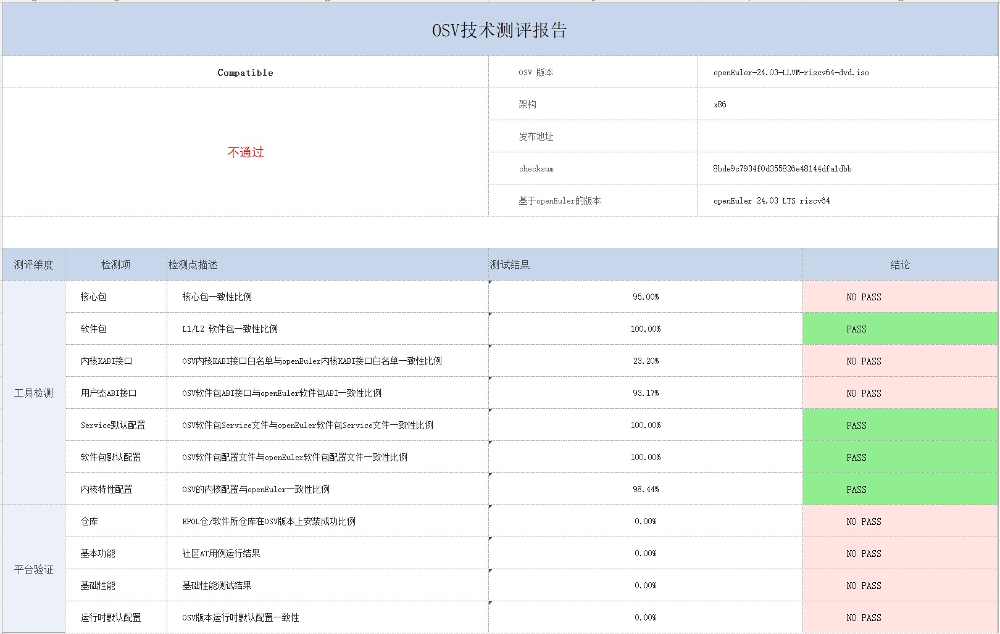

用 oech 测试 openEuler RISC-V 软件兼容性测试

#### 1. oech 介绍

OECP工具聚焦openEuler内核和基础包，保障二次发行版生态核心特性不丢失，关键配置不更改 结合社区选包策略及软件包等级策略，检查L1、L2软件包版本、打包方式、接口一致性，KABI白名单，架构特性(如鲲鹏/X86特性)使能，性能优化配置，牵引实现扩展仓库openEuler系共享、共用，主流行业应用在openEuler系不同的OSV生态复用度90%。

检测内容包括：

1）检测2个ISO（基于RPM）的软件包，软件包内文件，库文件接口（C/C++）,内核KABI的变化差异

2）检测同一个软件（rpm包）在不同版本下的变化以及差异

oecp测试包括2部分：

1）在本地执行这个测试工具用来比较2个iso文件的静态差异

2）在compass-ci上测试比较2个iso文件的动态差异

#### 2. oech 静态差异检测方法

测试环境：openEuler x86 24.03 LTS

 ##### 2.1 安装依赖包

````
$ yum install -y python3-devel sqlite libabigail-devel python3-pip
$ pip3 install pyyaml
````

##### 2.2 安装java

搜索jdk安装包，并选择其中一个进行安装

````
$ yum search java | grep jdk
$ yum install -y java-latest-openjdk-devel.x86_64
````

安装完成后，确认安装成功

````
$ java -version
openjdk version "21" 2023-09-19
OpenJDK Runtime Environment BiSheng (build 21+35)
OpenJDK 64-Bit Server VM BiSheng (build 21+35, mixed mode, sharing)
$ javac -version
javac 21
````

##### 2.3 安装 japi-compliance-checker

````
$ git clone https://github.com/lvc/japi-compliance-checker.git
$ cd japi-compliance-checker
$ make install prefix=/usr
````

确认 japi-compliance-checker 安装成功

````
$ japi-compliance-checker -test
Using Java 21

Verifying detectable Java library changes
Creating test library ...
Running tests ...
See journal with test results: libsample_java/Tests/Journal.txt
Preparing, please wait ...
Using Java 21
Reading classes 1.0 ...
Reading classes 2.0 ...
Comparing classes ...
Creating compatibility report ...
Binary compatibility: 64%
Source compatibility: 58.1%
Total binary compatibility problems: 72, warnings: 27
Total source compatibility problems: 92, warnings: 6
Report: compat_reports/libsample_java/1.0_to_2.0/compat_report.html
Test result: SUCCESS (164 breaks found)
````

##### 2.4 安装 oecp

安装依赖包

````
$ yum install -y createrepo binutils
````

下载源码执行安装

````
$ git clone https://gitee.com/openeuler/oecp.git
$ cd oecp
$ pip3 install -r requirement   #如果网络不好，可以指定python国内源安装，在命令后添加 -i https://pypi.tuna.tsinghua.edu.cn/simple
````

执行测试

````
$ python3 cli.py ../openEuler-24.03-LTS-riscv64-dvd.iso ../openEuler-24.03-LLVM-riscv64-dvd.iso
````

第一个 iso 文件是基线 iso，第二个 iso 文件是待测目标 iso

测试结束后，会在 /tmp/oecp 目录下生成测试报告，可以查看 osv_data_summary.xlsx




参考：

https://gitee.com/openeuler/technical-certification/blob/master/testing-tools/openEuler%E6%8A%80%E6%9C%AF%E6%B5%8B%E8%AF%84OSV%E6%93%8D%E4%BD%9C%E7%B3%BB%E7%BB%9F%E6%B5%8B%E8%AF%95%E5%B7%A5%E5%85%B7oecp%E7%94%A8%E6%88%B7%E6%8C%87%E5%8D%97.md

https://gitee.com/openeuler/oecp