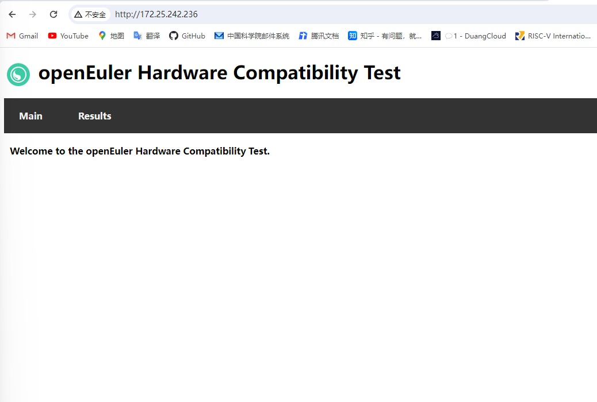
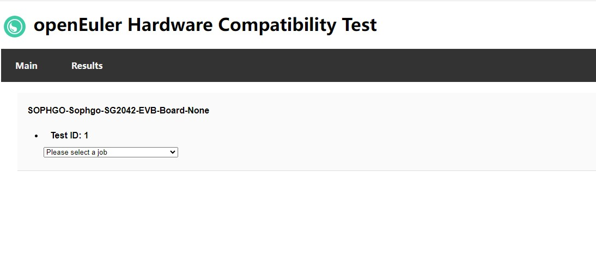
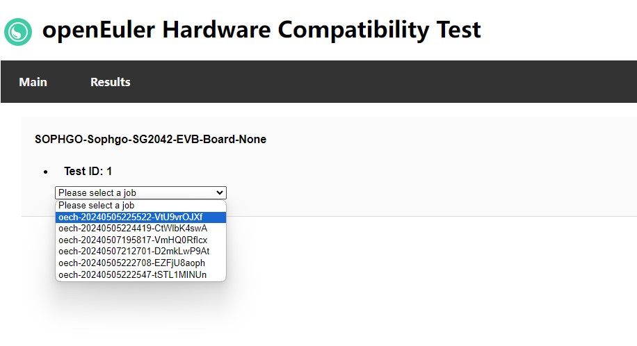
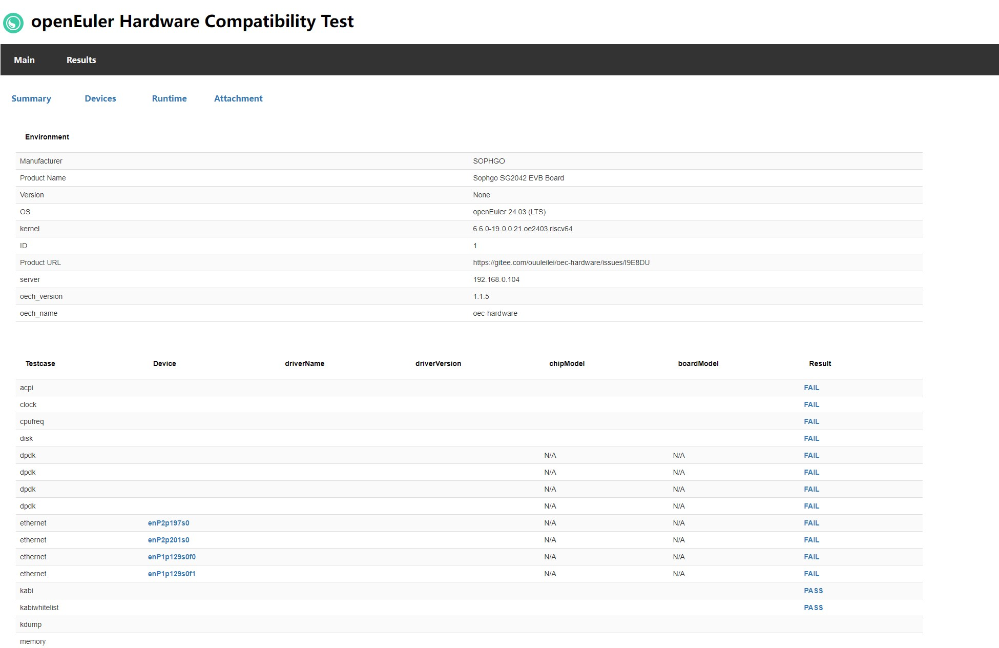
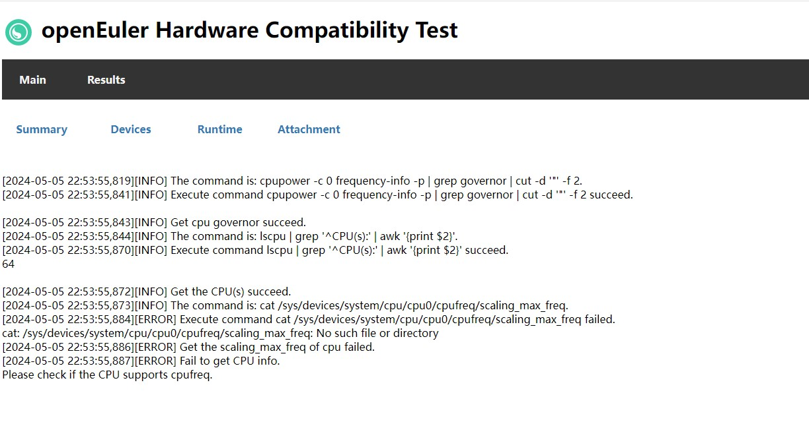

在openEuler RISC-V上使用oec-hardware执行南向兼容性测试

#### 1. oec-hardware简介

oec-hardware工具是openEuler社区提供的一款硬件兼容性测试工具，oec-hardware提供服务器整机、板卡与openEuler的兼容性验证测试，验证仅限于基本功能验证，不包括性能测试等其它测试。

oec-hardware安装使用问题解答： [https://bbs.huaweicloud.com/forum/thread-0210979171291590002-1-1.html](https://gitee.com/link?target=https%3A%2F%2Fbbs.huaweicloud.com%2Fforum%2Fthread-0210979171291590002-1-1.html)

oec-hardware 分为 sever 和 client，client 用来执行测试，server用来存储和现实测试结果，client 执行完测试可以将测试结果上传到server

#### 2. 测试环境

sg2042 作为 client 端，烧录 openEuler RISC-V 24.03 LTS 版本镜像 https://repo.tarsier-infra.isrc.ac.cn/openEuler-RISC-V/testing/2403LTS-test/v1/SG2042/

x86 虚拟机作为 server, 安装 openEuler x86 23.09 版本镜像 [https://mirrors.nju.edu.cn/openeuler/openEuler-23.09/ISO/x86_64/openEuler-23.09-x86_64-dvd.iso](https://gitee.com/link?target=https%3A%2F%2Fmirrors.nju.edu.cn%2Fopeneuler%2FopenEuler-23.09%2FISO%2Fx86_64%2FopenEuler-23.09-x86_64-dvd.iso)

server端和client端在同一网段里，client 和 server 可以互相 ping 通

#### 3. 测试方法

##### 3.1 Server 端

openEuler x86 作为 server 端，安装 oec-hardware-server

````
$ yum install oec-hardware-server
````

启动服务,此服务通过搭配 nginx 服务提供 web 服务，默认使用 80 端口，可以通过 nginx 服务配置文件修改对外端口，启动前请保证这些端口未被占用。

````
$ systemctl start oech-server.service
$ systemctl status oech-server.service
$ systemctl start nginx.service
$ systemctl status nginx.service
````

关闭防火墙和SElinux

````
$ systemctl stop firewalld
$ iptables -F
$ setenforce 0
````

在 x86 虚拟机的主机的浏览器里输入 http://<虚拟机ip> 会看到



由于测试 ethernet 时会使用 qperf，所以提前需要在 server 端安装并启动 qperf 监听，qperf 默认监听端口是 19765

````
$ yum install qperf
$ qperf
````

##### 3.2Client 端

sg2042 作为 client 端，安装 oec-hardware 

````
$ yum install oec-hardware
````

检查是否安装成功

````
$ oech --version
oec-hardware 1.1.5 
````

按照实际情况配置硬件测试项配置文件 /usr/share/oech/lib/config/test_config.yaml 里的ethernet测试项所需配置文件

````
$ ip a
1: lo: <LOOPBACK,UP,LOWER_UP> mtu 65536 qdisc noqueue state UNKNOWN group default qlen 1000
    link/loopback 00:00:00:00:00:00 brd 00:00:00:00:00:00
    inet 127.0.0.1/8 scope host lo
       valid_lft forever preferred_lft forever
    inet6 ::1/128 scope host noprefixroute 
       valid_lft forever preferred_lft forever
2: enP2p197s0: <BROADCAST,MULTICAST,UP,LOWER_UP> mtu 1500 qdisc fq_codel state UP group default qlen 1000
    link/ether 00:e0:4c:68:00:7b brd ff:ff:ff:ff:ff:ff
    inet 192.168.0.106/24 brd 192.168.0.255 scope global dynamic noprefixroute enP2p197s0
       valid_lft 7110sec preferred_lft 7110sec
    inet6 fe80::d95b:1e12:34d7:1a23/64 scope link noprefixroute 
       valid_lft forever preferred_lft forever
3: enP2p201s0: <NO-CARRIER,BROADCAST,MULTICAST,UP> mtu 1500 qdisc fq_codel state DOWN group default qlen 1000
    link/ether 00:e0:4c:68:00:7c brd ff:ff:ff:ff:ff:ff
4: enP1p129s0f0: <NO-CARRIER,BROADCAST,MULTICAST,UP> mtu 1500 qdisc mq state DOWN group default qlen 1000
    link/ether a0:36:9f:54:0c:c8 brd ff:ff:ff:ff:ff:ff
5: enP1p129s0f1: <NO-CARRIER,BROADCAST,MULTICAST,UP> mtu 1500 qdisc mq state DOWN group default qlen 1000
    link/ether a0:36:9f:54:0c:ca brd ff:ff:ff:ff:ff:ff
6: docker0: <NO-CARRIER,BROADCAST,MULTICAST,UP> mtu 1500 qdisc noqueue state DOWN group default 
    link/ether 02:42:11:1e:fb:9e brd ff:ff:ff:ff:ff:ff
    inet 172.17.0.1/16 brd 172.17.255.255 scope global docker0
       valid_lft forever preferred_lft forever
````

````
$ vim /usr/share/oech/lib/config/test_config.yaml
ethernet:
  # IP has been manually configured, get server IP.
  eth1:
    device: enP2p197s0
    if_rdma: N
    client_ip:
    server_ip: 192.168.0.103
  # Configure the IP obtained here.
  eth2:
    device: enP2p197s0
    if_rdma: N
    client_ip: 192.168.0.106
    server_ip: 192.168.0.103
  # The program automatically generates an IP address for IP configuration
  eth3:
    device: enP2p197s0
    if_rdma: y
    client_ip:
    server_ip:
````

其中 

device为网卡端口设备号，可以通过ip a查看

if_rdma表示是否测试网卡RDMA，默认是N，表示不测试RDMA

client_ip为客户端测试网卡配置的IP

server_ip为服务端测试网卡配置的IP

由于执行 memory 测试项，需要 swap 空间要在 4G 以上，所以需要生成 8G 的 swap 分区

````
$ dd if=/dev/zero of=swap8G bs=1G count=8
$ mkswap swap8G    //格式化swap分区
mkswap: swap8G: insecure permissions 0644, fix with: chmod 0600 swap8G
Setting up swapspace version 1, size = 8 GiB (8589930496 bytes)
no label, UUID=0761d505-1743-4506-9bd5-056bd27dd338
$ swapon swap8G    //挂载swap分区
swapon: /root/swap8G: insecure permissions 0644, 0600 suggested.
$ free -h      //查看当前swap可用空间
               total        used        free      shared  buff/cache   available
Mem:           120Gi       2.0Gi       111Gi       8.8Mi       8.5Gi       118Gi
Swap:          8.0Gi          0B       8.0Gi
````

需要插入U盘，测试disk项目需要，否则会测试失败，提示 No suite disk found to test.

配置完后，执行 oech 开始测试，选择测试类别，`compatible`表示兼容性，`virtualization`表示虚拟化，填写类别序号，即输入`1`表示选择的兼容性类别

````
$ oech
Please select test category.
No.   category
1     compatible
2     virtualization
Please select test category No:1
````

填写ID、URL、Server配置项，ID 可以理解为项目ID（建议填写 gitee 上的 issue ID,注意：ID中不能带特殊字符）；URL建议填写产品链接；Server 必须填写为客户端可以直接访问的服务器域名或 ip，用于展示测试报告和作网络测试的服务端。服务端nginx默认端口号是80，如果服务端安装完成后没有修改该端口，Compatibility Test Server 的值只需要输入服务端的业务IP地址；否则需要带上端口号，比如：172.167.145.2:90

````
The openEuler Hardware Compatibility Test Suite
Please provide your Compatibility Test ID:1
Please provide your Product URL: https://www.sophgo.com/product/introduce/sg2042.html
Please provide the Compatibility Test Server (Hostname or Ipaddr):192.168.0.103
````

进入测试套选择界面。在用例选择界面，框架将自动扫描硬件并选取当前环境可供测试的测试套，输入 `edit` 可以进入测试套选择界面

````
These tests are recommended to complete the compatible test: 
No. Run-Now?  status    Class         Device         driverName     driverVersion     chipModel           boardModel
1     yes     NotRun    acpi                                                                              
2     yes     NotRun    clock                                                                             
3     yes     NotRun    cpufreq                                                                           
4     yes     NotRun    disk                                                                              
5     yes     NotRun    dpdk          enP2p197s0                                      N/A                 N/A
6     yes     NotRun    dpdk          enP2p201s0                                      N/A                 N/A
7     yes     NotRun    dpdk          enP1p129s0f0                                    N/A                 N/A
8     yes     NotRun    dpdk          enP1p129s0f1                                    N/A                 N/A
9     yes     NotRun    ethernet      enP2p197s0                                      N/A                 N/A
10    yes     NotRun    ethernet      enP2p201s0                                      N/A                 N/A
11    yes     NotRun    ethernet      enP1p129s0f0                                    N/A                 N/A
12    yes     NotRun    ethernet      enP1p129s0f1                                    N/A                 N/A
13    yes     NotRun    kabi                                                                              
14    yes     NotRun    kabiwhitelist                                                                     
15    yes     NotRun    kdump                                                                             
16    yes     NotRun    memory                                                                            
17    yes     NotRun    nvme          nvme0n1                                         N/A                 N/A
18    yes     NotRun    perf                                                                              
19    yes     NotRun    spdk          nvme0n1                                         N/A                 N/A
20    yes     NotRun    system                                                                            
21    yes     NotRun    usb                                                                               
22    yes     NotRun    watchdog                                                                          
Ready to begin testing? (run|edit|quit)
````

选择测试套。`all|none` 分别用于 `全选|全取消`（必测项 `system` 不可取消，多次执行成功后 `system` 的状态会变为`Force`）；数字编号可选择测试套，每次只能选择一个数字，按回车符之后 `no` 变为 `yes`，表示已选择该测试套

````
Select tests to run:
No. Run-Now?  status    Class         Device         driverName     driverVersion     chipModel           boardModel
1     yes     NotRun    acpi                                                                              
2     yes     NotRun    clock                                                                             
3     yes     NotRun    cpufreq                                                                           
4     yes     NotRun    disk                                                                              
5     yes     NotRun    dpdk          enP2p197s0                                      N/A                 N/A
6     yes     NotRun    dpdk          enP2p201s0                                      N/A                 N/A
7     yes     NotRun    dpdk          enP1p129s0f0                                    N/A                 N/A
8     yes     NotRun    dpdk          enP1p129s0f1                                    N/A                 N/A
9     yes     NotRun    ethernet      enP2p197s0                                      N/A                 N/A
10    yes     NotRun    ethernet      enP2p201s0                                      N/A                 N/A
11    yes     NotRun    ethernet      enP1p129s0f0                                    N/A                 N/A
12    yes     NotRun    ethernet      enP1p129s0f1                                    N/A                 N/A
13    yes     NotRun    kabi                                                                              
14    yes     NotRun    kabiwhitelist                                                                     
15    yes     NotRun    kdump                                                                             
16    yes     NotRun    memory                                                                            
17    yes     NotRun    nvme          nvme0n1                                         N/A                 N/A
18    yes     NotRun    perf                                                                              
19    yes     NotRun    spdk          nvme0n1                                         N/A                 N/A
20    yes     NotRun    system                                                                            
21    yes     NotRun    usb                                                                               
22    yes     NotRun    watchdog                                                                          
Selection (<number>|all|none|quit|run): 
````

选择完成后，输入 run 执行测试，测试完成后显示如下结果

````
-----------------  Summary -----------------
acpi                                    FAIL
clock                                   FAIL
cpufreq                                 FAIL
disk                                    PASS
dpdk-enP2p197s0                         FAIL
dpdk-enP2p201s0                         FAIL
dpdk-enP1p129s0f0                       FAIL
dpdk-enP1p129s0f1                       FAIL
ethernet-enP2p197s0                     FAIL
ethernet-enP2p201s0                     FAIL
ethernet-enP1p129s0f0                   FAIL
ethernet-enP1p129s0f1                   FAIL
kabi                                    PASS
kabiwhitelist                           PASS
kdump                                   FAIL
memory                                  PASS
nvme-nvme0n1                            FAIL
perf                                    PASS
spdk-nvme0n1                            FAIL
system                                  FAIL
usb                                     PASS
watchdog                                PASS
Log saved to file: /usr/share/oech/logs/oech-20240507212701-D2mkLwP9At.tar succeed.
Do you want to submit last result? (y|n) y
Start to upload result to server 192.168.0.103, please wait.
Upload result to server 192.168.0.103 succeed.
````
测试 watchdog 时会自动重启设备，重启后再次执行oech,会提示是否上传log,选择y，在server端可以看到 watchdog 的测试结果

测试完成后，会提示是否将测试结果上传到 server，选择y 即可上传

执行过一次以后，之前配置的ID、URL、Server配置项都被存储到 /var/oech/ 下面的 json 文件里

测试日志存储正在 /usr/share/oech/logs 目录下

````
$ ls /usr/share/oech/logs
oech-20240507212701-D2mkLwP9At.tar
````

在 x86 虚拟机的主机的浏览器里输入 http://<虚拟机ip> 会看到测试结果选项，选择一个job，就可以看到这个job得执行结果







点击每一个测试项目 Result 栏位的内容，可以看到测试日志




参考：

https://gitee.com/ouuleilei/working-documents/blob/master/RISC-V/openEuler/oec-hardware/oec-hardware.md

https://gitee.com/ouuleilei/working-documents/blob/master/RISC-V/openEuler/oec-hardware/sg2042%E6%B5%8B%E8%AF%95.md

https://gitee.com/openeuler/oec-hardware

