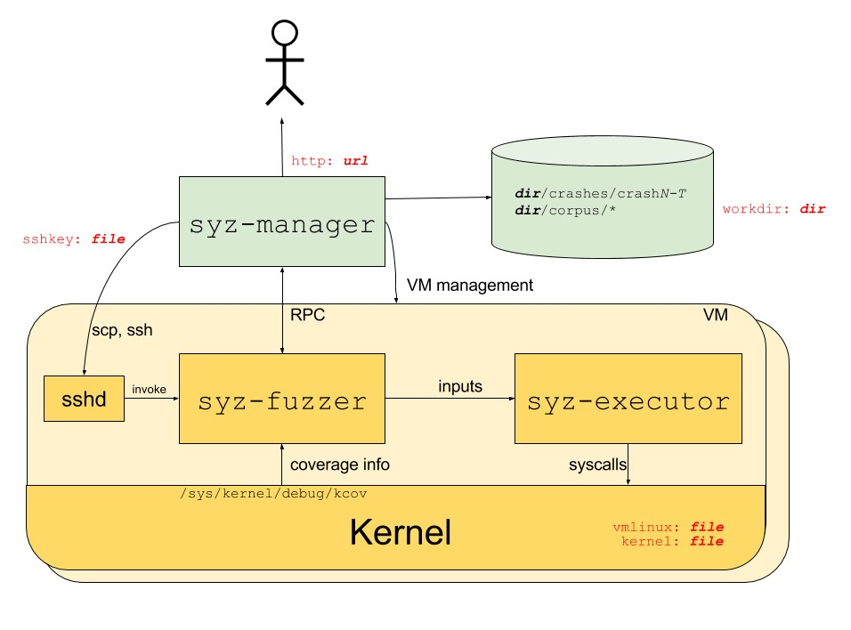

在 openEuler riscv64 中用 Syzkaller 对内核进行 Fuzz 测试

#### 1.  Syzkaller 介绍

Syzkaller 是一个由 Google 安全研究人员开发并维护的内核 fuzz 工具（2015年在 github 开源)，用 go 语言编写，含少部分c/c++代码，利用系统调用对内核进行 fuzzing。其优势在于会根据内核的代码路径覆盖信息来更新 fuzz 用的变异数据，以达到尽可能大的代码覆盖率。

Syzkaller 框架如下所示：



黄色部分：运行着被测目标内核文件的虚拟机或者物理设备(被fuzz的对象)

绿色部分：运行着 syzkaller 主程序的 PC(宿主机)

syz-manager：运行在 PC 上的主控程序。负责 fuzzing 调度、异常判断、问题复现和日志记录等。测试者通过 syz-manager 启动测试。 通过 ssh 方式发送 syz-fuzzer 可执行文件并到虚拟机中并启动。syz-manager 还会开启一个简单的 Web 服务，可查看当前的 fuzz 状态。

syz-fuzzer：进行 fuzzing 的主程序，根据文件系统 /sys/kernel/debug/kcov 获取内核代码覆盖率，并且生成新的变异数据，然后调用 syz-executor。

syz-executor：执行模块，根据 syz-fuzzer 传入的数据，执行系统调用。

#### 2. Syzkaller 使用方法

测试环境:

宿主机：ubuntu 22.04

虚拟机：QEMU

虚拟机镜像：[openEuler riscv64 23.09](https://repo.tarsier-infra.com/openEuler-RISC-V/preview/openEuler-23.09-V1-riscv64/QEMU/)

##### 2.1 安装go(宿主机)

syzkaller 要求 go 的版本必须是 1.20以上的版本，所以安装 go 的方式是从源码编译并安装。在编译 go 之前，先安装后续编译 go，syzkaller，kernel 所需软件包

````
$ sudo apt install -y qemu-system-misc build-essential gcc-riscv64-linux-gnu g++-riscv64-linux-gnu flex bison rpm libssl-dev libelf-dev tree dwarves zstd
$ riscv64-linux-gnu-gcc -v       //确认riscv64 gcc交叉编译工具链是否有被安装成功
$ riscv64-linux-gnu-g++ -v       //确认riscv64 g++交叉编译工具链是否有被安装成功
````

编译并安装 go

````
$ wget https://go.dev/dl/go1.21.6.linux-amd64.tar.gz
$ tar -xf go1.21.6.linux-amd64.tar.gz
$ export GOROOT=`pwd`/go
$ export PATH=$GOROOT/bin:$PATH
$ go version
````

##### 2.2 编译syzkaller(宿主机)

````
$ git clone https://github.com/google/syzkaller.git
$ cd syzkaller
$ make CC=riscv64-linux-gnu-g++ TARGETARCH=riscv64
````

编译完成后，在syzkaller目录下会出现一个bin目录，里面就是后边需要用到的二进制文件

````
$ tree ./bin
./bin
├── linux_riscv64
│   ├── syz-execprog
│   ├── syz-executor
│   ├── syz-fuzzer
│   └── syz-stress
├── syz-db
├── syz-manager
├── syz-mutate
├── syz-prog2c
├── syz-repro
├── syz-runtest
├── syz-sysgen
└── syz-upgrade

1 directory, 12 files
````

##### 2.3 编译内核(宿主机)

为了fuzz效率，需要打开一些 kernel 编译选项，所以需要重新编译所要测试的kernel，先下载内核源码

````
$ git clone https://gitee.com/openeuler/kernel.git
$ cd kernel
$ git checkout -b openEuler-2309 origin/openEuler-2309
$ git branch
````

由于 kernel 编译完后要安装到被测试的镜像中，为了和镜像中原 kernel 好区分，需要配置新编译的 kernel 版本号。配置的方法是修改 kernel 源码中的 Makefile

````
$ vim Makefile
VERSION = 6
PATCHLEVEL = 4
SUBLEVEL = 0
EXTRAVERSION =
NAME = Hurr durr I'ma ninja sloth
````

这里是将 SUBLEVEL 从0改为1，也可以根据自己的喜好改其他项目

````
VERSION = 6
PATCHLEVEL = 4
SUBLEVEL = 1
EXTRAVERSION =
NAME = Hurr durr I'ma ninja sloth
````

生成默认配置文件 .config

````
$ make mrproper
$ make ARCH=riscv CROSS_COMPILE=riscv64-linux-gnu- openeuler_defconfig
````

修改 .config 文件，开启一些调试选项，可参考 [Linux kernel configs](https://github.com/google/syzkaller/blob/master/docs/linux/kernel_configs.md) ，如果要开启 KASAN 相关选项，开启和添加的配置有

````
CONFIG_KASAN=y
CONFIG_KASAN_INLINE=y
CONFIG_KCOV=y
CONFIG_KCOV_ENABLE_COMPARISONS=y
CONFIG_KCOV_INSTRUMENT_ALL=y
CONFIG_DEBUG_FS=y
CONFIG_DEBUG_INFO=y
````

如果要开启 UBSAN 相关选项，开启和添加的配置有

````
CONFIG_UBSAN=y
CONFIG_UBSAN_INLINE=y
CONFIG_KCOV=y
CONFIG_KCOV_ENABLE_COMPARISONS=y
CONFIG_KCOV_INSTRUMENT_ALL=y
CONFIG_DEBUG_FS=y
CONFIG_DEBUG_INFO=y
````

KASAN：Kernel Address SANitizer，是一种内核级别的内存错误检测工具，用于检测和报告内核中的内存错误。它是 Linux 内核提供的一个特性，旨在帮助开发人员发现和修复内核中的内存安全问题。

CONFIG_KASAN=y 是一个内核配置选项，用于启用内核地址检测（Kernel Address SANitizer，简称 KASAN）特性。CONFIG_KASAN=y 表示将 KASAN 功能编译到内核中，以便在内核运行时进行内存错误检测。

CONFIG_KASAN_INLINE=y 是一个内核配置选项，用于启用 KASAN（Kernel Address SANitizer）的内联模式。内联模式是 KASAN 的一种编译选项，它将 KASAN 相关的代码直接内联到内核中，以提高检测的精确性和效率。通过设置 CONFIG_KASAN_INLINE=y，可以将 KASAN 的内联模式编译为内核的一部分。这意味着 KASAN 相关的代码会在编译期间被直接插入到内核中，而不是作为独立的模块加载。

UBSAN：Undefined Behavior Sanitizer，用于运行时未定义行为检测。UBSAN使用编译时指令来获取未定义行为。编译器插入代码，在可能引起UB的操作之前运行某类检查，如果失败，会调用__ubsan_handle_*函数来输出错误信息。

CONFIG_UBSAN=y 是 Linux 内核配置选项中的一个，它代表 “Undefined Behavior Sanitizer”。当这个选项被启用时，内核将包含对未定义行为检测的支持，这可以帮助开发者在内核代码中检测出潜在的编程错误。

CONFIG_UBSAN_INLINE=y 是 Linux 内核配置选项中的一个，它用于启用 Undefined Behavior Sanitizer（UBSAN）的内联检查功能。当 CONFIG_UBSAN_INLINE=y 被启用时，UBSAN 将使用内联函数来替代一些标准库函数，以便在运行时进行检查。这样做的好处是可以减少性能开销，因为内联函数通常比调用外部函数要快。

CONFIG_KCOV=y 是 Linux 内核配置选项中的一个，它代表 “Kernel Coverage”，即内核覆盖率。这个选项用于启用内核代码覆盖率追踪功能，它可以帮助开发者了解内核代码在运行时的执行情况。当 CONFIG_KCOV 被设置为 y（启用）时，内核会包含一个简单的覆盖率追踪系统，该系统可以记录在内核测试或性能测试中执行的指令数量。这有助于识别哪些内核代码被执行，哪些没有被执行，从而可以优化内核代码，去除未使用的代码，提高内核的效率和性能。

CONFIG_KCOV_ENABLE_COMPARISONS=y 是 Linux 内核配置选项中的一个，它与 CONFIG_KCOV 一起使用，用于启用内核覆盖率（Kernel Coverage）功能中的比较测试。这个选项在内核覆盖率追踪系统中用于启用比较测试功能，可以帮助开发者测试内核代码的不同路径是否按预期执行。当 CONFIG_KCOV_ENABLE_COMPARISONS 被设置为 y（启用）时，内核会执行比较测试，这些测试会比较内核代码的不同执行路径的结果。这样，开发者可以确保内核在不同条件下（如不同配置、不同硬件环境下）的行为是一致的，并且符合预期的。

CONFIG_KCOV_INSTRUMENT_ALL=y 是 Linux 内核配置选项中的一个，它用于启用内核覆盖率（Kernel Coverage）功能，并且特别指定了覆盖率追踪系统应该为内核中的所有指令路径提供追踪。当 CONFIG_KCOV_INSTRUMENT_ALL 被设置为 y（启用）时，内核覆盖率系统将尝试为内核代码中的所有指令路径提供覆盖率追踪。这意味着不仅主要的执行路径会被追踪，而且包括异常路径、中断处理程序和其他可能的执行分支也会被包括在内。

CONFIG_DEBUG_FS=y 是 Linux 内核配置选项中的一个，它用于启用内核的调试文件系统（Debug Filesystem）。当这个选项被启用时，内核将提供一个特殊的文件系统，它允许用户空间程序访问内核调试信息和数据。调试文件系统是一个虚拟的文件系统，它不会在实际的文件系统中创建文件，而是提供了一种机制，允许内核模块以安全的方式向用户空间报告信息和日志。这个文件系统通常挂载在 /sys/kernel/debug 目录下，并且提供了多种内核调试功能，如内核日志(printk 和 printk_ratelimit)输出，内核跟踪和跟踪点(tracepoints）的输出，内核指标(metrics)的输出，内核崩溃转储(core dumps)和其他调试信息的存储。使用 CONFIG_DEBUG_FS=y，开发者可以在用户空间应用程序中通过标准的文件系统接口访问这些调试信息，从而更容易地诊断和调试内核问题。

CONFIG_DEBUG_INFO=y 是 Linux 内核配置选项中的一个设置，用于启用内核的调试信息支持。CONFIG_DEBUG_INFO是一个控制是否编译内核调试信息的选项。当设置为 y（或 m）时，表示启用调试信息的编译

编辑完成后，重新生成配置文件并编译将内核编译成rpm包

````
$ make clean/
$ make ARCH=riscv CROSS_COMPILE=riscv64-linux-gnu- -j $(nproc) binrpm-pkg    //编译成rpm包
````

编译完成后会显示 kernel rpm 包存路径是 /opt/cloudroot/kernel/rpmbuild/RPMS/riscv64/kernel-6.6.0+-5.riscv64.rpm

##### 2.4 配置虚拟机QEMU(宿主机)

下载 [openEuler riscv64 23.09](https://repo.tarsier-infra.com/openEuler-RISC-V/preview/openEuler-23.09-V1-riscv64/QEMU/) 镜像，启动固件和 qemu 启动脚本，并解压镜像文件

````
$ wget https://repo.tarsier-infra.com/openEuler-RISC-V/preview/openEuler-23.09-V1-riscv64/QEMU/openEuler-23.09-V1-base-qemu-preview.qcow2.zst
$ wget https://repo.tarsier-infra.com/openEuler-RISC-V/preview/openEuler-23.09-V1-riscv64/QEMU/fw_payload_oe_uboot_2304.bin
$ wget https://repo.tarsier-infra.com/openEuler-RISC-V/preview/openEuler-23.09-V1-riscv64/QEMU/start_vm.sh
$ unzstd openEuler-23.09-V1-base-qemu-preview.qcow2.zst
````

运行启动 qemu 启动脚本，启动并登录 qemu (用户名/密码：root/openEuler12#$)

````
$ bash start_vm.sh
````

将 kernel rpm包通过 scp 方式复制到 qemu 中

````
$ scp -P 12055 /opt/cloudroot/kernel/rpmbuild/RPMS/riscv64/kernel-6.6.0+-5.riscv64.rpm root@127.0.0.1:/root
````

在 qemu 中安装 kernel rpm 包

````
$ uname -r    //查看当前镜像内核版本信息
6.4.0-10.1.0.20.oe2309.riscv64
````

````
$ rpm -ivh kernel-6.6.0+-5.riscv64.rpm --force
$ rpm -qa | grep kernel   //查看已安装的内核软件包,确认是否已安装成功
kernel-tools-6.4.0-10.1.0.20.oe2309.riscv64
kernel-6.4.0-10.1.0.20.oe2309.riscv64
kernel-6.4.1+-1.riscv64
````

修改启动内核，先查看目前已安装的内核

````
$ ls /boot     //查看已安装的内核
config-6.4.0-10.1.0.20.oe2309.riscv64
config-6.4.1+
dtb-6.4.0-10.1.0.20.oe2309.riscv64
extlinux
initramfs-0-rescue-c87a8f5fa6274439adda0483065162d9.img
initramfs-6.4.0-10.1.0.20.oe2309.riscv64.img
initramfs-6.4.1+.img
lost+found
symvers-6.4.0-10.1.0.20.oe2309.riscv64.gz
System.map
System.map-6.4.0-10.1.0.20.oe2309.riscv64
System.map-6.4.1+
vmlinuz
vmlinuz-0-rescue-c87a8f5fa6274439adda0483065162d9
vmlinuz-6.4.0-10.1.0.20.oe2309.riscv64
vmlinuz-6.4.1+
vmlinuz-openEuler
````

启动内核是在 /boot/extlinux/extlinux.conf 里配置的

````
$ vim /boot/extlinux/extlinux.conf
default openEuler-RISC-V
label   openEuler-RISC-V
    kernel /vmlinuz-openEuler
    append 'root=/dev/vda2 rw console=ttyS0 systemd.default_timeout_start_sec=600 selinux=0 highres=off earlycon no4lvl'
````

将其中的 kernel /vmlinuz-openEuler 改为所要使用的内核

````
$ cat /boot/extlinux/extlinux.conf
default openEuler-RISC-V
label   openEuler-RISC-V
    kernel /vmlinuz-6.4.1+
    append 'root=/dev/vda2 rw console=ttyS0 systemd.default_timeout_start_sec=600 selinux=0 highres=off earlycon no4lvl'
````

修改后，重启 qemu 并登录，查看当前镜像的内核是否有更换成功

````
$ uname -r
6.4.1+
````

禁用SELinux，将 /etc/selinux/config 文件中的 SELinux设置为 disable

````
$ vim /etc/selinux/config
# This file controls the state of SELinux on the system.
# SELINUX= can take one of these three values:
#     enforcing - SELinux security policy is enforced.
#     permissive - SELinux prints warnings instead of enforcing.
#     disabled - No SELinux policy is loaded.
SELINUX=disabled
# SELINUXTYPE= can take one of these three values:
#     targeted - Targeted processes are protected,
#     minimum - Modification of targeted policy. Only selected processes are proo
tected.
#     mls - Multi Level Security protection.
SELINUXTYPE=targeted
````

为了实现 RPC连接，需要修改 sshd 配置，将 /etc/ssh/sshd_config 文件中的 AllowTcpForwarding 设置为 yes，AllowAgentForwarding 设置为 yes

````
$ vim /etc/ssh/sshd_config
AllowAgentForwarding yes
AllowTcpForwarding yes
````

在宿主机上创建用于 ssh 免密访问的 RSA 密钥对，并将公钥复制到 qemu 中

````
$ ssh-keygen -t rsa
$ ssh-copy-id -p 12055 root@localhost
````

关闭虚拟机(快捷键先按住Ctrl+A松开后再按X)

##### 2.5 配置并运行 Syzkaller(宿主机)

在宿主机中创建工作目录，用来存储 syzkaller 运行中产生的文件

````
$ cd syzkaller
$ mkdir workdir
````

查看 syzkaller 源码中的 [vm/qemu/qemu.go](https://github.com/google/syzkaller/blob/master/vm/qemu/qemu.go) 文件，linux/riscv64架构下，qemu 命令参数的关于镜像的格式默认是raw，且无法通过配置进行修改，所以需要将镜像格式从 qcow2 转为 raw

```
$ qemu-img convert -f qcow2 -O raw openEuler-23.09-V1-base-qemu-preview.qcow2 openEuler-23.09-V1-base-qemu-preview.raw
```

为了使 syzkaller 运行起来，在 syzkaller 目录下，新建一个 config 文件用于配置运行所需参数(命名为xxx.cfg)，这里创建一个 fuzz.cfg 文件，内容如下：

````
{
  "target": "linux/riscv64",
  "http": "127.0.0.1:8080",
  "workdir": "/opt/cloudroot/syzkaller/workdir",
  #"kernel_obj": "/opt/cloudroot/kernel",
  "image": "/opt/cloudroot/oerv/openEuler-23.09-V1-base-qemu-preview.raw",
  "sshkey": "/opt/cloudroot/.ssh/id_rsa",
  "syzkaller": "/opt/cloudroot/syzkaller",
  "procs": 8,
  "type": "qemu",
  "vm": {
          "qemu": "qemu-system-riscv64",
          "count": 1,
          "cpu": 8,
          "mem": 8192,
          "qemu_args": "-nographic -machine virt -bios /opt/cloudroot/oerv/fw_payload_oe_uboot_2304.bin
  }
}
````

target：被测试设备的操作系统内核及cpu架构

http：syzkaller 运行后在宿主机上会启动一个http服务，这个服务的地址和访问端口，浏览器输入这个地址和端口可以查看 syzkaller 运行情况

workdir：宿主机上创建的工作目录

kernel_obj：编译 kernel 的源码目录

image：qemu镜像所在目录

sshkey：宿主机访问 ssh 访问 qemu 的私钥目录

syzkaller：syzkaller 源码目录

procs：被测试设备内的并行测试进程数，

type：被测设备类型，如果被测试设备是一个物理设备或者一个已经启动好的qemu，这里设置为 isolated

enable_syscalls：测试指定的几个系统调用

disable_syscalls：不测试指定的几个系统调用

vm：设置被测设备的属性和参数，包括有：

- qemu：使用的 qemu 二进制名称
- count：并行运行的qemu虚拟机数量
- cpu：qemu虚拟机的cpu数量
- mem：qemu虚拟机内存大小，单位是MiB
- qemu_args：qemu启动命令的其他参数
- cmdline：用于引导内核的其他命令行选项

各个字段的解释的官方文档：[config.go](https://github.com/google/syzkaller/blob/master/pkg/mgrconfig/config.go)

type为qemu情况下vm字段中的参数解释的官方文档：[qemu.go](https://github.com/google/syzkaller/blob/master/vm/qemu/qemu.go)

执行测试

````
$ ./bin/syz-manager -config=fuzz.cfg
````

如果希望可以看到执行后的详细情况，可以开启在 debug 模式下运行

````
$ ./bin/syz-manager -config=fuzz.cfg -debug
````

运行后，在浏览器中输入 cfg 文件中配置的 http 选项的地址和端口，会进入一个 web 界面，显示 syzkaller 的运行情况


参考：

[syzkaller官网](https://github.com/google/syzkaller)

[openEuler社区测试能力指南](https://gitee.com/openeuler/QA/blob/master/openEuler%E7%A4%BE%E5%8C%BA%E6%B5%8B%E8%AF%95%E8%83%BD%E5%8A%9B%E6%89%A7%E8%A1%8C%E6%8C%87%E5%8D%97/openEuler%E7%A4%BE%E5%8C%BA%E6%B5%8B%E8%AF%95%E8%83%BD%E5%8A%9B%E6%89%A7%E8%A1%8C%E6%8C%87%E5%8D%97.md#65syzkaller)

https://blingblingxuanxuan.github.io/2019/10/26/syzkaller/

