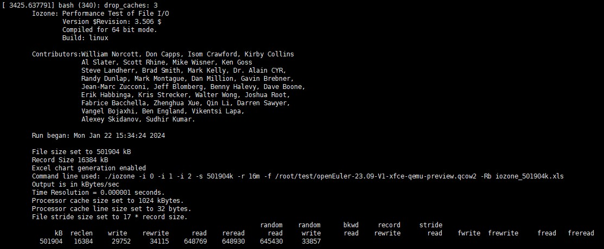

openEuler riscv64 中使用 iozone 进行文件读写性能测试

### 1. iozone 介绍

iozone 是一个开源文件系统基准工具，基准生成并测量各种文件操作。iozone 已被移植到许多机器上并可在许多操作系统下运行。该基准测试以下各项操作类型的文件 I/O 性能：

| 操作           | 说明                                                         |
| -------------- | ------------------------------------------------------------ |
| Read           | 测试读一个已存在的文件的性能                                 |
| Write          | 测试向一个新文件写入的性能                                   |
| Re-Read        | 测试读一个最近读过的文件的性能                               |
| Re-Write       | 测试向一个已存在的文件写入的性能                             |
| Random Read    | 测试读一个文件中的随机偏移量的性能                           |
| Random Write   | 测试写一个文件中的随机偏移量的性能                           |
| Random Mix     | 测试读写一个文件中的随机偏移量的性能                         |
| Backword Read  | 测试使用倒序读一个文件的性能                                 |
| Record Rewirte | 测试写与覆盖写一个文件中的特定块的性能                       |
| Stride Read    | 测试跳跃读一个文件的性能                                     |
| Fread          | 测试调用库函数fread()来读文件的性能                          |
| Fwrite         | 测试调用库函数fwrite()来写文件的性能                         |
| Freread        | 这个测试与上面的fread 类似，除了在这个测试中被读文件是最近才刚被读过。 |
| Frewrite       | 测试调用库函数fwrite()来写文件的性能                         |
| Mmap           | 测量使用mmap()机制完成I/O的性能                              |
| Async I/O      | 测量POSIX异步I/O机制的性能                                   |

### 2. iozone 命令介绍

 iozone [-s filesize_Kb] [-r record_size_Kb ] [-f [path]filename] [-i test] [-E] [-p] [-a] [-A] [-z] [-Z] [-m] [-M] [-t children] [-h] [-o] [-l min_number_procs] [-u max_number_procs] [-v] [-R] [-x] [-d microseconds] [-F path1 path2...] [-V pattern] [-j stride] [-T] [-C] [-B] [-D] [-G] [-I] [-H depth] [-k depth] [-U mount_point] [-S cache_size] [-O] [-K] [-L line_size] [-g max_filesize_Kb] [-n min_filesize_Kb] [-N] [-Q] [-P start_cpu] [-c] [-e] [-b filename] [-J milliseconds] [-X filename] [-Y filename] [-w] [-W] [-y min_recordsize_Kb] [-q max_recordsize_Kb] [-+m filename] [-+n] [-+N] [-+u ] [ -+d ] [-+p percent_read] [-+r] [-+t ] [-+A #]

参数介绍：

| 参数 | 说明                                                         |
| ---- | ------------------------------------------------------------ |
| -a   | 用来使用全自动模式。                                         |
| -A   | 这种版本的自动模式提供更加全面的测试但是消耗更多时间。       |
| -b   | 输出结果时将创建一个兼容Excel的二进制格式文件                |
| -f   | 指定测试文件的名字                                           |
| -g   | 设置自动模式可使用的最大文件大小                             |
| -h   | 显示帮助                                                     |
| -i   | 用来指定运行的测试（ (0=write/rewrite, 1=read/re-read, 2=random-read/write 3=Read-backwards, 4=Re-write-record, 5=stride-read, 6=fwrite/re-fwrite, 7=fread/Re-fread, 8=random mix, 9=pwrite/Re-pwrite, 10=pread/Re-pread, 11=pwritev/Re-pwritev, 12=preadv/Repreadv) |
| -r   | 指定一次写入/读出的块大小，单位可以是k(Kbytes)，m(Mbytes)，g(Gbytes) |
| -R   | 产生Excel到标准输出                                          |
| -s   | 指定测试文件大小，单位可以是k(Kbytes)，m(Mbytes)，g(Gbytes)  |

### 3. iozone 安装编译和执行测试

#### 3.1 安装编译

从 [iozone 官网](https://www.iozone.org/)下载源码，并编译安装

````
$ wget https://www.iozone.org/src/current/iozone3_506.tar
$ tar -xvf iozone3_506.tar
$ cd iozone3_506/src/current
$ make clean && make CFLAGS=-fcommon linux
````

格式化磁盘并挂载

````
$ mkdir -p /root/test
$ mkfs.ext4 -F -E lazy_itable_init=0 /dev/sda1
$ mount -odioread_lock /dev/sda1 /root/test
````

在磁盘中存放测试文件，需要注意的是测试文件大小一定要大过硬件设备内存(最佳为内存的两倍大小)，不然linux会将读写内容进行缓存，会导致数值不真实。

#### 3.2 执行测试

硬件环境：D1开发板烧入openEuler riscv64 22.03 v2 版本 https://repo.tarsier-infra.com/openEuler-RISC-V/preview/openEuler-22.03-V2-riscv64/D1/

获取内存大小

````
$ mem_size=`cat /proc/meminfo | grep MemTotal | grep -P '\d+' -o`    //获取内存大小的数值
$ mem_size_unit=`cat /proc/meminfo | grep MemTotal | rev | cut -b 2`   //获取内存大小的单位
$ half_mem_size=`expr $mem_size / 2`
$ double_mem_size=`expr $mem_size + $mem_size`
````

针对测试文件为硬件设备内存大小的1/2，1倍，2倍进行测试

````
$ for i in $double_mem_size $mem_size $half_mem_size
> do
> sync
> echo 3 > /proc/sys/vm/drop_caches    //清除缓存
> taskset -c 0 ./iozone -i 0 -i 1 -i 2 -s ${i}${mem_size_unit} -r 16m -f /root/test/openEuler-23.09-V1-xfce-qemu-preview.qcow2 -Rb iozone_${i}${mem_size_unit}.xls    //在指定序号为0的逻辑 cpu 上执行 iozone 测试
> sleep 5
> done
````

测试结果：




第1列KB：表示用于测试的文件大小，可以用参数 -s 指定

第2列reclen：表示用于测试的记录长度，可以用参数 -r 指定

第3列到最后：表示执行的各种测试的每秒输出值，以图3为例，测试结果的意思是测试文件大小为501904KB，以记录大小为16384KB来进行传输，他的write，rewrite，read，reread，random read，random write 的传输速度分别为29752，34115，648769，648930，645430，33857 Kbytes/s


参考：

https://www.iozone.org/

https://blog.csdn.net/IT_xiao_bai0516/article/details/128646544

https://wenku.baidu.com/view/d039d301bed5b9f3f90f1c21.html?_wkts_=1705815097140&bdQuery=iozone

https://gitee.com/openeuler/QA/blob/master/openEuler%E7%A4%BE%E5%8C%BA%E6%B5%8B%E8%AF%95%E8%83%BD%E5%8A%9B%E6%89%A7%E8%A1%8C%E6%8C%87%E5%8D%97/openEuler%E7%A4%BE%E5%8C%BA%E6%B5%8B%E8%AF%95%E8%83%BD%E5%8A%9B%E6%89%A7%E8%A1%8C%E6%8C%87%E5%8D%97.md#23iozone

